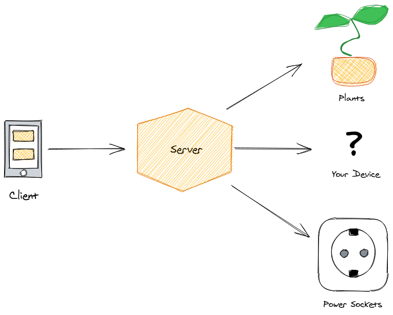

# Karl-Heinz
***Disclaimer:*** *The project is still under development and not usable yet.*  

Karl-Heinz is a home automation system. It is pluggable, so you can easily add your own components to it.  
Currently, it is intended to track the humidity of plants and toggle remote power sockets. 

## Concept
Karl-Heinz builds up around the concept of rooms containing different components one can control or observe.  
