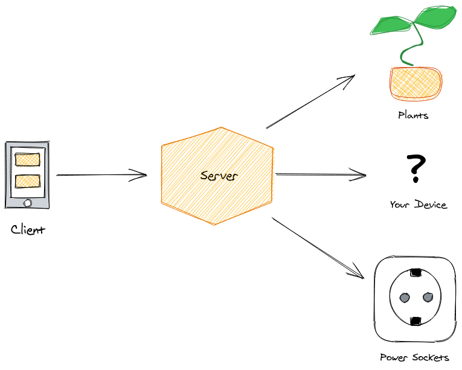
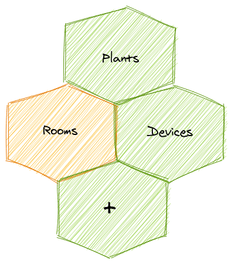

# Karl-Heinz
***Disclaimer:*** *The project is still under development and not usable yet.*  

Karl-Heinz is a home automation system. It is pluggable, so you can easily add your own components to it.  
Currently, it is intended to track the humidity of plants and toggle devices, controlled by remote power sockets.   
Since devices are toggled by the RF power sockets, it basically does not matter if it is a table lamp, 
a computer or speakers.

## Concept
Karl-Heinz builds up around the concept of rooms containing different components one can control or observe.  

### Plants
Plants are, on a lower level, NodeMCU microcontrollers that track the humidity of the plants soil and push their data
to an MQTT broker.  
*In a later iteration, these controllers might also control a small water tank.*

### Devices
Devices are, on a lower level, (currently) remote power sockets, controlled via radio frequency 
that can be toggled on and off.  
The idea is to keep this definition broad, to enable other kinds of devices, for example dimmable lights.

### Your Module!
Since the rooms only act as a kind of facade in front of the single modules, adding a custom one will be no hassle.